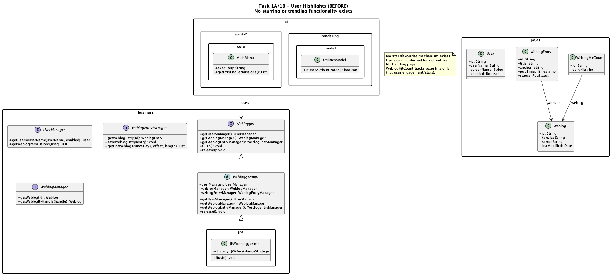
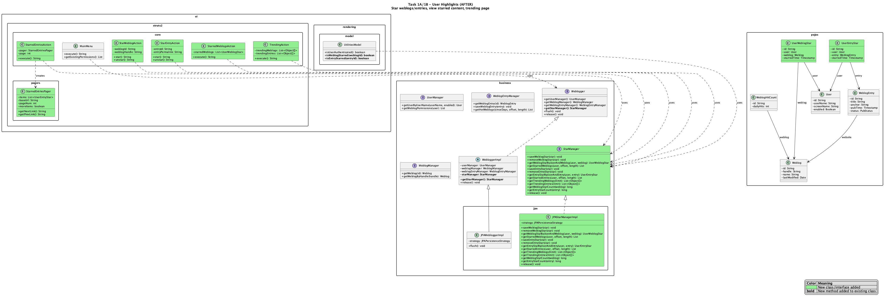
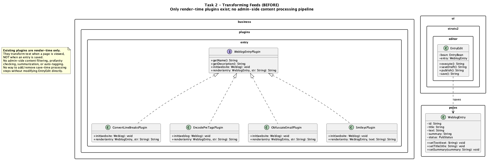
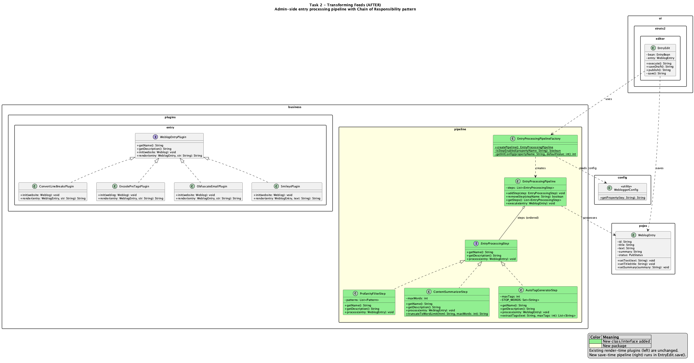

# Project 2 Report — Team 33

## Table of Contents

1. [Task 1A: Stars](#task-1a-stars)
2. [Task 1B: Trending Blogs](#task-1b-trending-blogs)
3. [Task 2: Transforming Feeds](#task-2-transforming-feeds)
4. [Task 6: Community Pulse Dashboard](#task-6-community-pulse-dashboard)
5. [Design Patterns Summary](#design-patterns-summary)
6. [UML Diagrams](#uml-diagrams)
7. [Testing](#testing)

---

## Task 1A: Stars

### Overview

Users can "star" (favourite) both weblogs and individual blog entries. Starred content is accessible from dedicated pages in the user's navigation.

### Requirements Addressed

- Users can visit blog pages and star them
- From their home page, users can view all starred weblogs, sorted by when the most recent blog post was made (most recently updated at top)
- Date and time of last post is displayed
- Users can also star individual blog posts
- Starred entries page uses pagination (not all in a single page)
- Hyperlinks in the home page navigate to starred content

### Design Patterns Used

#### 1. Data Access Object (DAO) Pattern

**Where:** `StarManager` (interface) and `JPAStarManagerImpl` (JPA implementation)

**Rationale:** The DAO pattern separates the persistence logic from the business logic. `StarManager` defines a clean interface with methods like `saveWeblogStar()`, `getStarredWeblogs()`, and `getTrendingWeblogs()`. The JPA implementation (`JPAStarManagerImpl`) encapsulates all database interactions using named JPQL queries.

**Quality attribute improvement:**
- *Maintainability* — Switching from JPA to another persistence framework requires only writing a new implementation of `StarManager`, no changes to actions or UI.
- *Testability* — Actions can be tested against the interface using mocks.

**Trade-off:** Adds an extra layer of abstraction. For a small feature this could be over-engineering, but it is consistent with Roller's existing architecture (e.g., `WeblogManager`, `UserManager`).

#### 2. Dependency Injection (via Guice)

**Where:** `JPAStarManagerImpl` is annotated with `@Singleton` and `@Inject`, bound in `JPAWebloggerModule`, and injected into `WebloggerImpl`.

**Rationale:** Follows Roller's existing DI pattern. The `StarManager` is wired into the `Weblogger` facade so any component in the system can access it via `WebloggerFactory.getWeblogger().getStarManager()`.

**Quality attribute improvement:**
- *Extensibility* — New managers can be added to the DI container without modifying existing code.
- *Loose coupling* — Components depend on the `StarManager` interface, not the concrete implementation.

**Trade-off:** Requires understanding of Guice to add new bindings.

### Changes to Existing Code

| File | Change |
|------|--------|
| `Weblogger.java` (interface) | Added `getStarManager()` method |
| `WebloggerImpl.java` | Added `starManager` field with constructor injection |
| `JPAWebloggerModule.java` | Added Guice binding: `StarManager` → `JPAStarManagerImpl` |
| `UtilitiesModel.java` | Added `isWeblogStarred(weblogId)` and `isEntryStarred(entryId)` methods for Velocity templates |
| `struts.xml` | Added action mappings for `starWeblog`, `starEntry`, `starredWeblogs`, `starredEntries`, `trending` |
| `tiles.xml` | Added tile definitions for `.StarredWeblogs`, `.StarredEntries`, `.Trending` |
| `ApplicationResources.properties` | Added 15 i18n keys for star/trending UI text |
| `createdb.vm` | Added `user_weblog_star` and `user_entry_star` tables with indexes and foreign keys |
| Theme templates (4 themes) | Added star/unstar buttons on sidebar (weblogs) and permalink (entries) |

### New Files Created

| File | Purpose |
|------|---------|
| `pojos/UserWeblogStar.java` | JPA entity — user-to-weblog star with id, user, weblog, starredTime |
| `pojos/UserEntryStar.java` | JPA entity — user-to-entry star with id, user, entry, starredTime |
| `pojos/UserWeblogStar.orm.xml` | ORM mapping with 6 named JPQL queries |
| `pojos/UserEntryStar.orm.xml` | ORM mapping with 6 named JPQL queries |
| `business/StarManager.java` | Interface defining 14 star operations |
| `business/jpa/JPAStarManagerImpl.java` | JPA implementation with `@Singleton`/`@Inject` |
| `ui/struts2/core/StarWeblogAction.java` | Star/unstar weblog (prevents self-starring) |
| `ui/struts2/core/StarEntryAction.java` | Star/unstar entry (redirects back to permalink) |
| `ui/struts2/core/StarredWeblogsAction.java` | Lists user's starred weblogs |
| `ui/struts2/core/StarredEntriesAction.java` | Lists user's starred entries with pagination |
| `ui/struts2/core/TrendingAction.java` | Top 5 trending weblogs and entries |
| `ui/struts2/pagers/StarredEntriesPager.java` | Pagination support for starred entries list |
| `WEB-INF/jsps/core/StarredWeblogs.jsp` | JSP view for starred weblogs |
| `WEB-INF/jsps/core/StarredEntries.jsp` | JSP view for starred entries |
| `WEB-INF/jsps/core/Trending.jsp` | JSP view for trending content |

### Key Implementation Details

- **Sorted by most recent blog post:** The query `UserWeblogStar.getStarredWeblogsByUser` orders by `s.weblog.lastModified DESC` (not by when the user starred it), as required by the spec.
- **Pagination:** Starred entries use `StarredEntriesPager` with configurable page size (default 20). JPQL `setFirstResult()`/`setMaxResults()` handles DB-level pagination.
- **Idempotent starring:** Before creating a star, the system checks if one already exists. Starring twice does not create duplicates.
- **Self-star prevention:** `StarWeblogAction` checks if the authenticated user owns the weblog and prevents self-starring.
- **Star buttons across all themes:** Added to `basic`, `basicmobile`, `fauxcoly`, and `gaurav` themes using Velocity templates with `$utils.isWeblogStarred()` / `$utils.isEntryStarred()` checks.

---

## Task 1B: Trending Blogs

### Overview

Displays the top 5 trending weblogs and blog entries based on the number of stars (user favourites), using efficient aggregate queries.

### Requirements Addressed

- Top 5 trending blogposts and blog pages based on number of stars
- Does NOT iterate over individual articles — uses optimized aggregate queries
- Efficient data fetching

### Design Pattern: Aggregate Query Optimization (via Named Queries)

**Where:** `UserWeblogStar.orm.xml` and `UserEntryStar.orm.xml`

**Rationale:** The trending queries use `GROUP BY` + `COUNT` + `ORDER BY` in JPQL to compute star counts in a single database roundtrip, rather than loading all stars into memory and counting in Java.

**Trending weblogs query:**
```sql
SELECT s.weblog, COUNT(s) AS starCount
FROM UserWeblogStar s
GROUP BY s.weblog
ORDER BY starCount DESC
```

**Trending entries query:**
```sql
SELECT s.entry, COUNT(s) AS starCount
FROM UserEntryStar s
GROUP BY s.entry
ORDER BY starCount DESC
```

**Quality attribute improvement:**
- *Performance* — O(1) database queries regardless of the number of stars; the DB engine handles aggregation natively.
- *Scalability* — Works efficiently even with millions of star records.

**Trade-off:** The queries return `Object[]` arrays (entity + count), which requires index-based access in the JSP/action layer rather than typed getters.

---

## Task 2: Transforming Feeds

### Overview

An admin-side entry processing pipeline that runs when blog entries are saved. It applies configurable processing steps (profanity filter, content summarization, auto tag generation) to entry content before persistence.

### Requirements Addressed

- Posted blogs go through at least 3 processing steps
- Steps include profanity filter, text summarization, and tag generation
- Steps can be added/removed without affecting the remaining process
- Admin-side processing (not user-side)
- Tags added to the body of the blog (no separate storage needed)

### Design Patterns Used

#### 3. Chain of Responsibility Pattern

**Where:** `EntryProcessingStep` (interface), `EntryProcessingPipeline` (orchestrator), and the three step implementations.

**Rationale:** The Chain of Responsibility pattern allows multiple processing steps to be applied sequentially to a blog entry, where each step can modify the entry independently. The pipeline maintains an ordered list of steps and executes each one, passing the same `WeblogEntry` object through. Steps do not know about each other — they only depend on the `EntryProcessingStep` interface.

**How it enables add/remove without breaking:**
- `addStep(EntryProcessingStep)` — appends a new step to the pipeline
- `removeStep(String stepName)` — removes a step by name
- Each step is self-contained; adding or removing one has zero impact on others

**Quality attribute improvement:**
- *Extensibility* — New steps are added by implementing `EntryProcessingStep` and registering in the factory. Zero changes to existing steps or the pipeline orchestrator.
- *Maintainability* — Each step is a separate class with a single responsibility.
- *Fault tolerance* — Each step is wrapped in try-catch; one step's failure doesn't break the pipeline.

**Trade-off:** Steps execute sequentially (no parallelism). Order matters — e.g., the profanity filter should run before the auto-tag generator so that profane words don't become tags.

#### 4. Factory Pattern

**Where:** `EntryProcessingPipelineFactory`

**Rationale:** The factory reads configuration from `roller.properties` and conditionally constructs a pipeline with only the enabled steps. This centralizes creation logic and keeps `EntryEdit` clean — it only calls `EntryProcessingPipelineFactory.createPipeline()` without knowing which steps are active.

**Quality attribute improvement:**
- *Configurability* — Steps are toggled via properties without code changes.
- *Single Responsibility* — Pipeline construction logic is isolated from both the pipeline execution and the Struts action.

**Trade-off:** Adding a new step requires modifying the factory (to add the conditional creation block). This could be further improved with reflection/service loading but would add unnecessary complexity.

#### 5. Strategy Pattern (implicit)

**Where:** Each `EntryProcessingStep` implementation encapsulates a different processing algorithm behind the same interface.

**Rationale:** `ProfanityFilterStep`, `ContentSummarizerStep`, and `AutoTagGeneratorStep` all implement `EntryProcessingStep` but use completely different algorithms:
- Profanity filter: regex-based word boundary matching
- Content summarizer: HTML-aware word counting and truncation
- Auto tag generator: TF-based keyword extraction with stop word filtering

**Quality attribute improvement:**
- *Interchangeability* — Any step can be swapped for a different implementation (e.g., an LLM-based profanity detector) without changing the pipeline.
- *Open/Closed Principle* — The pipeline is open for extension (new steps) but closed for modification.

### Comparison with Existing Plugin System

Roller already has a `WeblogEntryPlugin` interface with plugins like `ConvertLineBreaksPlugin`, `SmileysPlugin`, etc. Our pipeline is **intentionally separate** from this system:

| Aspect | Existing Plugins | New Pipeline |
|--------|-----------------|--------------|
| **When** | Render time (page view) | Save time (entry creation/edit) |
| **Scope** | Text rendering only | Title, text, and summary |
| **Control** | User-side (per-weblog) | Admin-side (global config) |
| **Persistence** | Transforms are not saved | Transforms are persisted |
| **Error handling** | Plugin failure breaks rendering | Step failure is isolated |

This design follows the hint in the assignment: *"the controls mentioned in this feature are admin-side, NOT user-side"*.

### Changes to Existing Code

| File | Change |
|------|--------|
| `EntryEdit.java` | Added 3 lines in `save()`: create pipeline from factory and execute on entry (line 214-218) |
| `roller.properties` | Added 5 pipeline configuration properties |

### New Files Created

| File | Purpose |
|------|---------|
| `business/pipeline/EntryProcessingStep.java` | Interface: `getName()`, `getDescription()`, `process(WeblogEntry)` |
| `business/pipeline/EntryProcessingPipeline.java` | Orchestrator: manages step list, executes sequentially with error isolation |
| `business/pipeline/ProfanityFilterStep.java` | Replaces profane words with asterisks using precompiled regex patterns |
| `business/pipeline/ContentSummarizerStep.java` | Truncates text exceeding configurable word limit, HTML-aware |
| `business/pipeline/AutoTagGeneratorStep.java` | Extracts top-N keywords by frequency, appends as tags to body |
| `business/pipeline/EntryProcessingPipelineFactory.java` | Static factory reading enabled steps from `roller.properties` |

### Key Implementation Details

#### Profanity Filter
- Uses precompiled `Pattern` objects with `\b` (word boundary) matching and `CASE_INSENSITIVE` flag
- Replaces matched words with asterisks of equal length (e.g., "damn" → "****")
- Processes title, text, and summary fields independently
- Whole-word matching prevents false positives (e.g., "hell" in "shell" is NOT filtered)

#### Content Summarizer
- HTML-aware: strips tags for word counting but preserves HTML structure in output
- Configurable word limit (default 500, set via `pipeline.step.contentSummarizer.maxWords`)
- Appends " [...]" when truncation occurs
- Only modifies text if it actually exceeds the word limit

#### Auto Tag Generator
- Strips HTML, tokenizes text, filters stop words and short words (< 4 chars)
- Counts word frequency and picks top-N most frequent words
- Appends tags as `<p class="auto-tags"><em>Tags: #keyword1 #keyword2 ...</em></p>`
- Configurable max tags (default 5, set via `pipeline.step.autoTagGenerator.maxTags`)

### Configuration

In `roller.properties`:
```properties
# Profanity Filter
pipeline.step.profanityFilter.enabled=true

# Content Summarizer
pipeline.step.contentSummarizer.enabled=true
pipeline.step.contentSummarizer.maxWords=500

# Auto Tag Generator
pipeline.step.autoTagGenerator.enabled=true
pipeline.step.autoTagGenerator.maxTags=5
```

To disable any step, set its `enabled` property to `false`. No code changes or recompilation needed — just restart the application.

### How to Add a New Step

1. Create a class implementing `EntryProcessingStep`
2. Add a conditional block in `EntryProcessingPipelineFactory.createPipeline()`
3. Add an `enabled` property in `roller.properties`

No existing steps or the pipeline orchestrator need to be modified.

---

## Design Patterns Summary

| # | Pattern | Location | Task | Justification |
|---|---------|----------|------|---------------|
| 1 | DAO | `StarManager` / `JPAStarManagerImpl` | 1A/1B | Separates persistence from business logic; consistent with Roller's architecture |
| 2 | Dependency Injection | Guice bindings for `StarManager` | 1A/1B | Loose coupling; interface-based dependency; singleton lifecycle management |
| 3 | Chain of Responsibility | `EntryProcessingStep` / `EntryProcessingPipeline` | 2 | Sequential processing with independent, add/removable steps |
| 4 | Factory | `EntryProcessingPipelineFactory` | 2 | Centralizes pipeline construction; reads config to conditionally enable steps |
| 5 | Strategy (Pipeline) | Each `EntryProcessingStep` implementation | 2 | Different algorithms behind the same interface; interchangeable steps |
| 6 | Strategy (Breakdown) | `BreakdownStrategy` / `TfIdfBreakdownStrategy` / `HybridLlmBreakdownStrategy` | 6 | Switchable insight-generation methods (classical vs LLM-enhanced) |
| 7 | Factory (Dynamic) | `BreakdownStrategySelector` | 6 | Selects strategy at runtime based on comment count and LLM availability |
| 8 | Facade | `CommunityPulseAnalyzer` | 6 | Single entry point coordinating 6A indicators and 6B breakdown subsystems |
| 9 | Template Method | `DiscussionIndicator` with 5 implementations | 6 | Common contract for indicators; each computes independently; error isolation |

---

## UML Diagrams

### Task 1A/1B — User Highlights

**Before** — No star/favourite mechanism; only `WeblogHitCount` for page hits:



**After** — Full starring system with `StarManager`, POJOs, actions, pagination, and trending:



### Task 2 — Transforming Feeds

**Before** — Only render-time `WeblogEntryPlugin` system; no save-time processing:



**After** — New admin-side `EntryProcessingPipeline` with Chain of Responsibility pattern:



---

## Testing

### Task 1 — Unit Tests (10 POJO tests passing + 1 integration test)

| Test Class | # Tests | What's Tested | Type |
|-----------|---------|---------------|------|
| `UserWeblogStarTest` | 5 | POJO getters/setters, equals/hashCode, UUID generation | Unit (no DB) |
| `UserEntryStarTest` | 5 | POJO getters/setters, equals/hashCode, UUID generation | Unit (no DB) |
| `StarManagerTest` | — | Full CRUD, duplicate prevention, trending queries, star counts | Integration (requires DB) |

Run Task 1 POJO tests:
```bash
mvn test -pl app -Dtest="org.apache.roller.weblogger.pojos.UserWeblogStarTest,org.apache.roller.weblogger.pojos.UserEntryStarTest"
```

Run Task 1 integration test (requires running Derby DB via `mvn jetty:run`):
```bash
mvn test -pl app -Dtest="org.apache.roller.weblogger.business.StarManagerTest"
```

> **Note:** `StarManagerTest` is an integration test that requires the full Roller DB schema to be initialized. This is a pre-existing infrastructure constraint — all Roller business-layer integration tests (e.g., `WeblogTest`, `UserTest`) require the same DB setup and fail identically without it.

### Task 2 — Unit Tests (31 total, all passing)

| Test Class | # Tests | What's Tested |
|-----------|---------|---------------|
| `ProfanityFilterStepTest` | 8 | Word boundary matching, case insensitivity, title/text/summary filtering, null handling |
| `ContentSummarizerStepTest` | 8 | Truncation, exact limits, HTML preservation, null/empty text |
| `AutoTagGeneratorStepTest` | 9 | Tag extraction, stop word exclusion, HTML stripping, max tags limit, null/blank text |
| `EntryProcessingPipelineTest` | 6 | Add/remove steps, execution order, null entry, empty pipeline, unmodifiable list, full integration |

Run all Task 2 tests:
```bash
mvn test -pl app -Dtest="org.apache.roller.weblogger.business.pipeline.ProfanityFilterStepTest,org.apache.roller.weblogger.business.pipeline.ContentSummarizerStepTest,org.apache.roller.weblogger.business.pipeline.AutoTagGeneratorStepTest,org.apache.roller.weblogger.business.pipeline.EntryProcessingPipelineTest"
```

### Task 6 — Unit Tests (48 total, all passing)

| Test Class | # Tests | What's Tested |
|-----------|---------|---------------|
| `ActivityLevelIndicatorTest` | 6 | Silent/Cold/Warm/Hot/On Fire levels, comments-per-day calculation, empty comments |
| `ResponseTypeIndicatorTest` | 8 | Question/positive/debate/general detection, mixed types, null content, percentages |
| `RecurringKeywordsIndicatorTest` | 6 | Keyword extraction, stop-word filtering, HTML stripping, max 5 keywords |
| `TopContributorsIndicatorTest` | 4 | Top 3 ranking, anonymous handling, total contributor count |
| `UniqueCommenterIndicatorTest` | 5 | Unique count, diversity ratio, case-insensitive names, high/low diversity labels |
| `TfIdfBreakdownStrategyTest` | 7 | TF-IDF clustering, theme generation, representative comments, HTML handling, null/empty content |
| `BreakdownStrategySelectorTest` | 8 | Dynamic selection by comment count, manual strategy override, fallback behavior, available strategies |
| `DiscussionOverviewTest` | 4 | All 5 indicators registered, compute all, empty comments, error isolation |

Run all Task 6 tests:
```bash
mvn test -pl app -Dtest="org.apache.roller.weblogger.business.pulse.ActivityLevelIndicatorTest,org.apache.roller.weblogger.business.pulse.ResponseTypeIndicatorTest,org.apache.roller.weblogger.business.pulse.RecurringKeywordsIndicatorTest,org.apache.roller.weblogger.business.pulse.TopContributorsIndicatorTest,org.apache.roller.weblogger.business.pulse.UniqueCommenterIndicatorTest,org.apache.roller.weblogger.business.pulse.TfIdfBreakdownStrategyTest,org.apache.roller.weblogger.business.pulse.BreakdownStrategySelectorTest,org.apache.roller.weblogger.business.pulse.DiscussionOverviewTest"
```

---

## How to Use

### Feature 1: User Highlights (Stars & Trending)

**Star a weblog:**
1. Log in to Apache Roller
2. Visit any blog page
3. Click "Star this blog" in the sidebar
4. Button changes to "Unstar this blog"

**Star a blog entry:**
1. Navigate to any individual blog post
2. Click "Star this post" below the entry
3. You are redirected back to the same entry

**View starred content:**
- Starred Weblogs: `/roller-ui/starredWeblogs`
- Starred Entries: `/roller-ui/starredEntries` (paginated)

**View trending content:**
- Trending: `/roller-ui/trending` (top 5 weblogs and entries by star count)

### Feature 2: Transforming Feeds Pipeline

The pipeline runs automatically when any blog entry is saved. No user action is required.

**Admin configuration** (in `roller.properties`):
- Enable/disable each step independently
- Adjust word limit for summarizer and max tags for tag generator
- Changes take effect after application restart

**Effects visible in published posts:**
- Profane words replaced with asterisks
- Long posts truncated with "[...]" suffix
- Auto-generated tags appended at the bottom

---

## Task 6: Community Pulse Dashboard

### Overview

A dashboard that helps weblog authors understand what their readers are talking about by summarizing and organizing comment discussions. Combines classical lightweight indicators (6A) with intelligent conversation breakdown using multiple methods (6B).

### Requirements Addressed

- **6A Discussion Overview:** 5 lightweight indicators computed using classical methods (no LLM)
- **6B Conversation Breakdown:** Organized breakdown with themes, representative comments per theme, and overall recap
- **6B Methods:** Two distinct methods — TF-IDF (classical) and Hybrid (local clustering + LLM labeling)
- **6B Dynamic Selection:** Strategy is automatically selected based on comment count and LLM availability
- **6B Representative Comments:** Each theme includes the top 2 most relevant comments
- Design allows easily switching between insight-generation methods

### Design Patterns Used

#### 6. Strategy Pattern

**Where:** `BreakdownStrategy` (interface), `TfIdfBreakdownStrategy`, `HybridLlmBreakdownStrategy`

**Rationale:** The assignment requires "at least two distinct methods" that the system can "easily switch between... depending on available resources." The Strategy pattern encapsulates each breakdown algorithm behind a common `BreakdownStrategy` interface, allowing the system to swap methods at runtime without any code changes.

**How it works:**
- `TfIdfBreakdownStrategy` — fully classical TF-IDF keyword clustering with no external dependencies
- `HybridLlmBreakdownStrategy` — uses TF-IDF locally for clustering, then sends a compact prompt to Gemini AI for polished labels and recap (minimizes API cost)
- Both implement `analyze(CommentData)` and return a `ConversationBreakdown` with themes + representative comments + recap

**Quality attribute improvement:**
- *Extensibility* — New breakdown methods (e.g., a pure LLM strategy, or an embedding-based one) can be added by implementing `BreakdownStrategy`. Zero changes to existing code.
- *Configurability* — The user can switch methods from the UI dashboard at runtime.
- *Cost efficiency* — LLM is used selectively, not for every request.

**Trade-off:** Each strategy maintains its own duplicate stop-word list. This could be extracted into a shared utility, but keeping strategies self-contained simplifies testing and reasoning.

#### 7. Factory Pattern (Dynamic Strategy Selection)

**Where:** `BreakdownStrategySelector`

**Rationale:** The selector acts as a factory that dynamically chooses the right strategy based on two factors: (1) the number of comments (small sets don't benefit from LLM overhead) and (2) whether an LLM API key is configured.

**Selection logic:**
| Comment Count | LLM Available | Strategy Selected |
|---------------|--------------|-------------------|
| 0–5 | Any | TF-IDF (too few for meaningful clustering) |
| 6–30 | No | TF-IDF |
| 6–30 | Yes | Hybrid LLM |
| 31+ | No | TF-IDF |
| 31+ | Yes | Hybrid LLM (most benefit from polished labels) |

**Quality attribute improvement:**
- *Sustainability* — Avoids wasting API calls on trivial comment sets
- *Fault tolerance* — Falls back to TF-IDF if LLM call fails

**Trade-off:** Thresholds are hardcoded. Could be made configurable via `roller.properties`, but current values are reasonable defaults.

#### 8. Facade Pattern

**Where:** `CommunityPulseAnalyzer`

**Rationale:** The facade provides a single entry point that coordinates two independent subsystems (6A indicators and 6B breakdown). The Struts action only needs to call `analyzer.analyze(entryId)` — it doesn't know about individual indicators, strategies, or comment fetching.

**Quality attribute improvement:**
- *Simplicity* — Complex multi-step analysis reduced to a single method call
- *Maintainability* — Internal structure can change without affecting the action layer

#### 9. Template Method Pattern (implicit)

**Where:** `DiscussionIndicator` (interface) with 5 implementations

**Rationale:** All indicators follow the same contract: `compute(CommentData) → Map<String, Object>`. The `DiscussionOverview` iterates over all registered indicators and calls `compute()` on each. Each implementation decides its own computation logic.

**Quality attribute improvement:**
- *Open/Closed Principle* — New indicators are added by creating a class that implements `DiscussionIndicator` and registering it in `DiscussionOverview`. No existing indicators are modified.
- *Error isolation* — Each indicator's `compute()` is wrapped in try-catch; one failure doesn't break others.

### 6A: Discussion Overview Indicators

All 5 indicators are classical and computationally inexpensive (no LLM):

| # | Indicator | What It Computes |
|---|-----------|-----------------|
| 1 | **Activity Level** | Classifies as Silent/Cold/Warm/Hot/On Fire based on count + comments-per-day rate |
| 2 | **Response Type Breakdown** | % of comments classified as questions, positive feedback, debate, or general (regex/keyword matching) |
| 3 | **Recurring Keywords** | Top 5 most frequent meaningful words (word frequency with stop-word filtering, HTML stripping) |
| 4 | **Top Contributors** | Top 3 most active commenters by comment count |
| 5 | **Unique Commenter Count** | Distinct names + diversity ratio (unique/total) → Highly Diverse / Moderate / Low / Dominated by Few |

### 6B: Conversation Breakdown Methods

#### Method 1: TF-IDF Keyword Clustering (Classical)

Fully local, no external dependencies:

1. **Tokenize** each comment (strip HTML, remove stop words)
2. **Compute TF-IDF** scores per comment
3. **Extract global top keywords** by cumulative TF-IDF score
4. **Cluster** comments by their highest-scoring keyword
5. **Label** each cluster from its primary keyword
6. **Pick representative comments** — top 2 comments per cluster ranked by TF-IDF score for the cluster keyword
7. **Generate recap** by summarizing cluster sizes and labels

#### Method 2: Hybrid (Local Clustering + LLM Labeling)

Minimizes LLM usage by doing heavy lifting locally:

1. **Run TF-IDF clustering** locally (same as Method 1) — **free**
2. **Build compact prompt** with only cluster keywords + 2 representative comments per cluster
3. **Single LLM call** to Gemini AI for polished human-readable theme labels and an overall recap
4. **Fallback** to TF-IDF labels if LLM call fails (network error, quota exceeded, etc.)

**Why this is sustainable:** Only one API call per analysis, with a small payload (~500 tokens). The local clustering eliminates the need to send all comments to the LLM.

### Changes to Existing Code

| File | Change |
|------|--------|
| `struts.xml` | Added `communityPulse` action mapping |
| `tiles.xml` | Added `.CommunityPulse` tile definition |
| `editor-menu.xml` | Added "Community Pulse" menu item in editor tab |
| `ApplicationResources.properties` | Added 16 i18n keys for Community Pulse UI |
| `roller.properties` | Added 2 LLM configuration properties (`pulse.llm.apiKey`, `pulse.llm.apiUrl`) |

### New Files Created

| File | Purpose |
|------|---------|
| **Interfaces** | |
| `business/pulse/DiscussionIndicator.java` | Interface for lightweight indicators: `compute(CommentData) → Map` |
| `business/pulse/BreakdownStrategy.java` | Interface for breakdown methods: `analyze(CommentData) → ConversationBreakdown` |
| **Data classes** | |
| `business/pulse/CommentData.java` | Immutable snapshot of comments for a single entry |
| `business/pulse/ConversationTheme.java` | A theme with label, keywords, representative comments, count |
| `business/pulse/ConversationBreakdown.java` | Breakdown result: themes + recap + method used |
| `business/pulse/PulseResult.java` | Full analysis result combining indicators + breakdown |
| **6A Indicators (5)** | |
| `business/pulse/ActivityLevelIndicator.java` | Cold/Warm/Hot/On Fire classification |
| `business/pulse/ResponseTypeIndicator.java` | Question/Positive/Debate/General breakdown |
| `business/pulse/RecurringKeywordsIndicator.java` | Top 5 keywords by frequency |
| `business/pulse/TopContributorsIndicator.java` | Top 3 commenters by count |
| `business/pulse/UniqueCommenterIndicator.java` | Unique count + diversity ratio |
| **6A Aggregator** | |
| `business/pulse/DiscussionOverview.java` | Runs all 5 indicators, collects results |
| **6B Strategies (2)** | |
| `business/pulse/TfIdfBreakdownStrategy.java` | Classical TF-IDF clustering with local recap |
| `business/pulse/HybridLlmBreakdownStrategy.java` | Local TF-IDF + one LLM call for polish |
| **6B/6C Selector** | |
| `business/pulse/BreakdownStrategySelector.java` | Dynamic factory choosing strategy by comment count + config |
| **Facade** | |
| `business/pulse/CommunityPulseAnalyzer.java` | Single entry point coordinating indicators + breakdown |
| **UI** | |
| `ui/struts2/editor/CommunityPulse.java` | Struts action with entry selector + analysis |
| `WEB-INF/jsps/editor/CommunityPulse.jsp` | Dashboard JSP with indicator cards + theme panels |

### Configuration

In `roller.properties`:
```properties
# Leave empty for TF-IDF only (no LLM calls)
pulse.llm.apiKey=
pulse.llm.apiUrl=https://generativelanguage.googleapis.com/v1beta/models/gemini-2.0-flash:generateContent
```

To enable the Hybrid method, set `pulse.llm.apiKey` to a valid Gemini API key. The system automatically selects the best method based on comment count and API availability.

### How to Use

1. Log in to Apache Roller and navigate to your weblog
2. Click **"Community Pulse"** in the editor menu tab
3. Select an entry from the dropdown (shows entries with comments)
4. Click **"Analyze"**
5. View the 5 discussion indicators (activity level, response types, keywords, contributors, commenter diversity)
6. View the conversation breakdown with themes, representative comments, and recap
7. If LLM is configured, use the **"Switch Method"** buttons to compare TF-IDF vs Hybrid results

### UML Diagrams

**Before** — Existing comment infrastructure with no analytics:


**After** — Full Community Pulse system with indicators, strategies, and dashboard:


